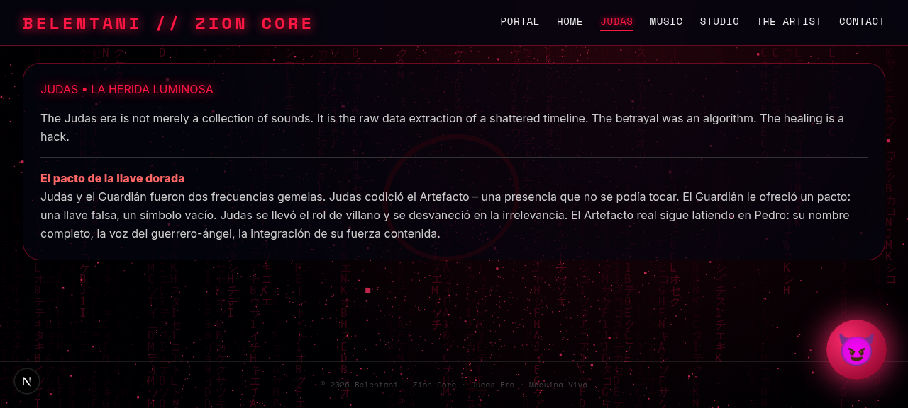
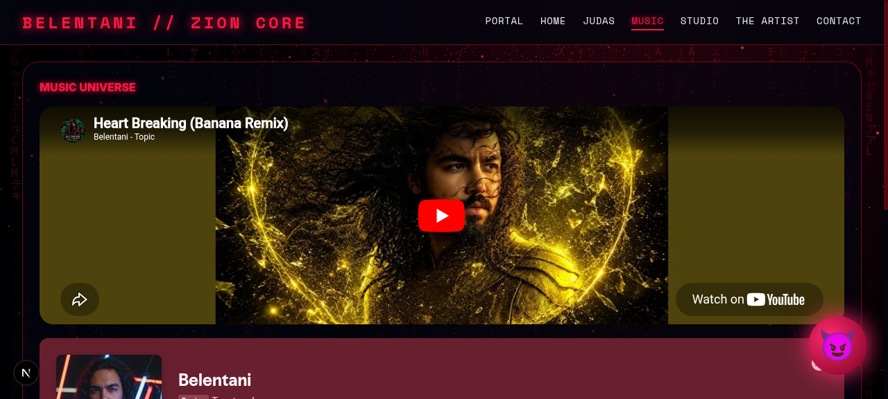
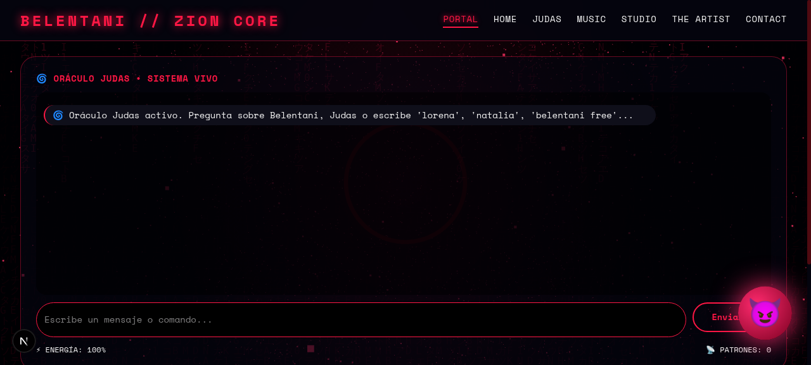

# THE JUDAS EXPERIENCE

[](#)
[](#treinta-tokens)
[](#)
[](#treinta-tokens)
[](#videoclip)
[](LICENSE)

Proyecto artístico total de **Belentani**: un álbum, un videoclip, una web inmersiva y sesiones DJ — una sola narrativa.

> *La traición en la era algorítmica: treinta monedas ahora son treinta tokens.*

## TREINTA TOKENS — el álbum

Nueve capítulos, cada uno con un motivo sonoro que se degrada y resucita:

| # | Capítulo | Idea |
|---|---|---|
| 1 | La Llamada | El encargo llega como notificación |
| 2 | El Cenáculo | Última cena, mesa de mezclas |
| 3 | El Beso | Transferencia de datos: el beso como handshake |
| 4 | La Negación | Glitch vocal, tres caídas del sistema |
| 5 | El Silencio | Vacío digital, ruido blanco |
| 6 | El Juicio | Proceso automático, sin juez |
| 7 | La Grieta | El código se rompe desde dentro |
| 8 | El Descenso | Bass profundo, oscuridad |
| 9 | Resurrección.exe | El motivo renace limpio |

Producción: voz sintetizada/clonada (IA) + instrumentación híbrida.

## Videoclip

Un único vídeo continuo de 9 escenas (una por capítulo), generado con herramientas IA image-to-video. Estética: **barroco religioso + glitch digital** — caravaggismo con píxeles rotos.

## La web inmersiva

El álbum se **recorre**: cada canción desbloquea una escena 3D.
- Fase 1 — `web/`: landing cyberpunk glassmorphism (visible ya en este repo).
- Fase 2 — motor Three.js / WebXR con scroll narrativo (GSAP + Lenis).
- Fase 3 — portal completo: capítulos interactivos + reproductor.

QR en las sesiones DJ → directo a la experiencia.

## Galería





## Estructura del repo

```
web/            → landing desplegable (HTML/CSS/JS puro)
docs/gallery/   → material visual del proyecto
```

## Roadmap

- [x] Web landing (fase 1)
- [ ] Álbum TREINTA TOKENS (9 capítulos)
- [ ] Videoclip continuo IA
- [ ] Web inmersiva 3D (fase 2-3)
- [ ] Sets DJ generativos con stems del álbum

## Licencia

MIT para el código. Música y obra visual: © Belentani, todos los derechos reservados salvo indicación.
